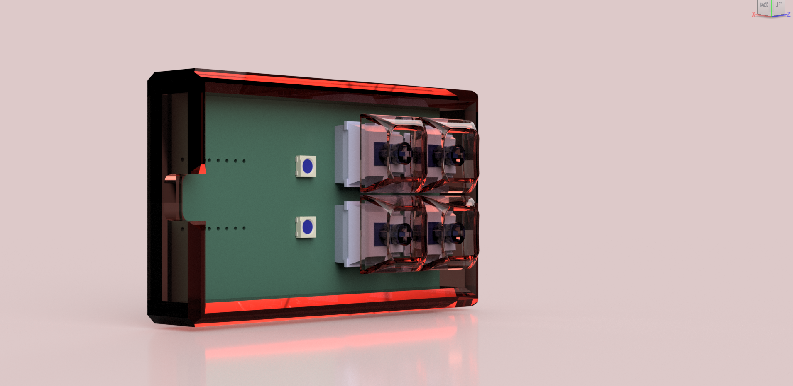
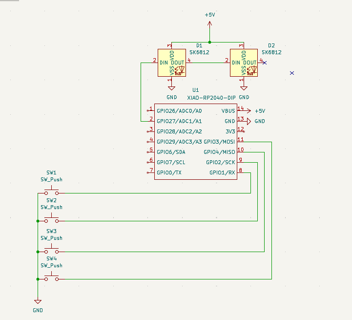
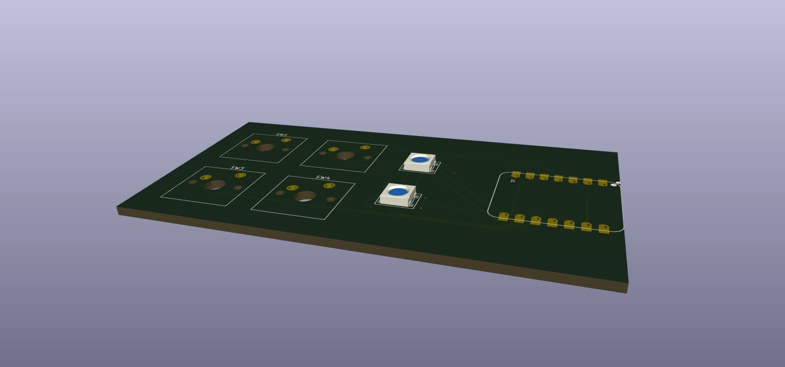
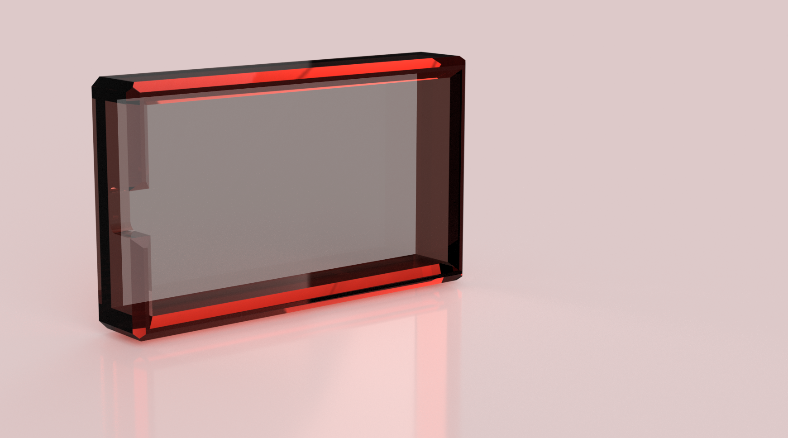

# highway hackpad
pov: you make your first hardware project and with 12 channel pings in ur personal channel and 8 people helping you build a pcb.
im very proud of my determination and i kept going even when i wanted to give up.

### inspiration
my original inspiration was to build a hackpad that would help me copy and paste, delete, space and using f5 for dev tools as it would help me debug at a faster pace

### Specifications

bom:
4x cherry mx switches (blue)
2x SK6812 mini leds
1x XIAO rp2040
4x blank dsa keycaps (black)

others:
- kmk firmware
- top.step 
- bottom.step

### final product

schematic            |  pcb         |   case
:-------------------------:|:-------------------------:|:-------------------------:|
    |    | 
